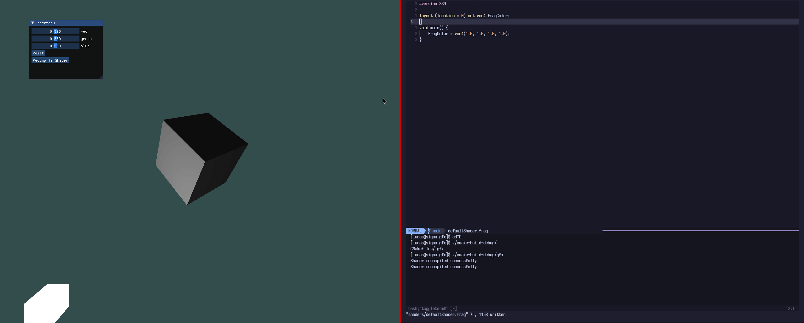
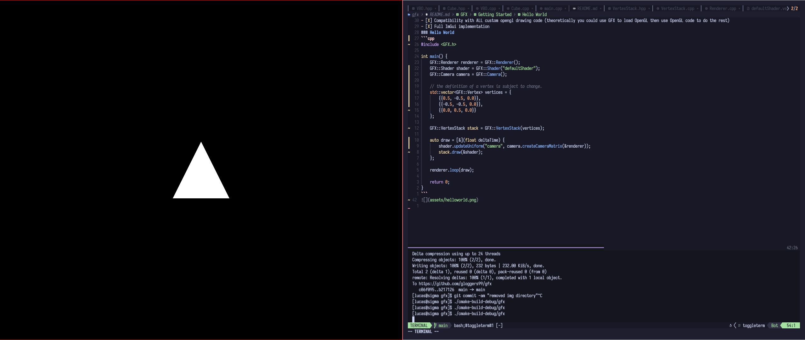

<div align="center">


<br />

[](https://forthebadge.com)
[](https://forthebadge.com)
[](https://forthebadge.com)
</div>

<!--toc:start-->
- [Getting Started](#getting-started)
  - [What is GFX](#what-is-gfx)
  - [Features](#features)
  - [Installation](#installation)
  - [Hello World](#hello-world)
  - [Shader Watcher Example](#shader-watcher-example)
  - [OBJ Loader](#obj-loader)
<!--toc:end-->

## Getting Started
### What is GFX
GFX is a simple C++ graphics library that uses GLFW to create a basic multiplatform window, then provide easy to use rendering tools using the GFX:: directive.

<sub><sup>Automatic shader hot reloading showcase</sup></sub>
### Features
- [X] VertexStack for automatic VAO creation and dynamic vertex management
- [X] Multithreaded insanely fast OBJ and MTL importer (300 thousand triangles in ~1000 milliseconds)
- [X] Declarative assignable keybind map
- [X] Multithreaded automatic hot reloadable shader compilation
- [X] Compatibility with ALL custom opengl drawing code (theoretically you could use GFX to load OpenGL then use OpenGL code to do the rest)
- [X] Full ImGui implementation (Currently doesn't work on windows)
- [X] Cross Platform
- [X] Logging system implemented with [hermes](https://github.com/gloggers99/hermes)
### Installation
#### Linux/Mac
GFX will eventually be added to package repositories when I believe it is stable and actually usable. For now the following commands will work.  
You will need to have the following dependencies installed:
- cmake (3.2 or above)
- gcc (g++ in specific)
- make
- git
```shell
git clone https://github.com/gloggers99/gfx.git --recurse-submodules
cd ./gfx
mkdir ./cmake-build-debug
cd ./cmake-build-debug
cmake ..
sudo make install
```
#### Windows
Binary zips with header files will be distributed when GFX is in a more stable point, however for now you will need to build it yourself, windows is pretty annoying when it comes to building software, the simplest way would be to install CLion and load up the GFX repository and click build
### Hello World
```cpp
#include <GFX.h>

int main() {
    GFX::Renderer renderer = GFX::Renderer();
    GFX::Shader shader = GFX::Shader("defaultShader");
    GFX::Camera camera = GFX::Camera();

    // define how you want your vertex to be formatted:
    struct MyVertex {
        glm::vec3 pos;
    };
    
    // define the memory layout of your vertex:
    // each member of this vector should be the 
    // amount of float values in the section
    std::vector<unsigned int> vertexTable = { 3 };

    GFX::VertexStack stack = GFX::VertexStack<MyVertex>({
        { { 0.5, -0.5, 0.0 } },
        { { -0.5, -0.5, 0.0 } },
        { { 0.0, 0.5, 0.0 } }
    }, vertexTable);

    auto draw = [&](float deltaTime) {
        shader.updateUniform("camera", camera.createCameraMatrix(&renderer));
        stack.draw(&shader);
    };

    renderer.loop(draw);

    return 0;
}
```
Now compile the program with the following commands:
```bash
g++ ./main.cpp -lgfx -o main
```
You should get something like this!

### Shader Watcher Example
Shader Watcher is a feature that automatically reloads shaders when the source code for them is changed. This is incredibly useful for debugging shaders as you can see the changes in real-time.
```cpp
#include <GFX.h>

int main() {
    GFX::Renderer renderer = GFX::Renderer();
    GFX::Camera camera = GFX::Camera();

    GFX::Shader shader = GFX::Shader("defaultShader");

    /*
        Shader Watcher runs on a seperate thread and checks 
        for file changes using inotify, or the Windows API 
        on windows. Shader Watcher will ONLY watch the 
        shaders you explicitly attach.
    */
    GFX::ShaderWatcher watcher = GFX::ShaderWatcher();
    watcher.attach(&shader);

    struct MyVertex {
        glm::vec3 pos;
    };
    

    GFX::VertexStack stack = GFX::VertexStack<MyVertex>({
        { { 0.5, -0.5, 0.0 } },
        { { -0.5, -0.5, 0.0 } },
        { { 0.0, 0.5, 0.0 } }
    }, { 3 });

    auto draw = [&](float deltaTime) {
        // each frame you must call checkShaders to recompile the changed shaders.
        watcher.checkShaders();
        shader.updateUniform("camera", camera.createCameraMatrix(&renderer));
        
        stack.draw(&shader);
    };

    renderer.loop(draw);

    return 0;
}
```
### OBJ Loader
The OBJ loader in GFX is made completely from scratch using bare C++, it is multithreaded (ONLY for loading the file into vertices, the GPU object is made on the main thread) priority is speed and accuracy and compatibility. It is capable of loading a model with ~12 thousand faces in ~300 milliseconds, and a model with 345 thousand faces (stanford armadillo) in just over 1100 milliseconds. 
> [!CAUTION]
> Do not import models that use quads, if you are using blender export with the triangulate toggle on. Loading quads is a WIP feature.
```cpp
#include <GFX.h>

int main() {
    GFX::Renderer renderer = GFX::Renderer();
    GFX::Shader shader = GFX::Shader("defaultShader");
    GFX::Camera camera = GFX::Camera();
    
    GFX::Model model = GFX::Model("path/to/file.obj");
    
    // the model loader does NOT automatically load in materials, 
    // this is subject to change but here is the current way.
    GFX::Material material = GFX::Material("path/to/file.mtl");
    model.material = material;
    
    // texture maps are automatically loaded by GFX::Material as long 
    // as they exist, if they don't an error will be thrown.
    
    // texture mapping is kind of WIP, the specification for GFX's glsl
    // features are coming soon.

    auto draw = [&](float deltaTime) {
        shader.updateUniform("camera", camera.createCameraMatrix(&renderer));
        // scale the model down a bit
        shader.updateUniform("transform", glm::scale(glm::mat4(1.0f), glm::vec3(0.1f, 0.1f, 0.1f)));

        // make sure you handle the sampler2d in your shader
        model.draw(&shader);
    };

    renderer.loop(draw);

    return 0;
}
```
